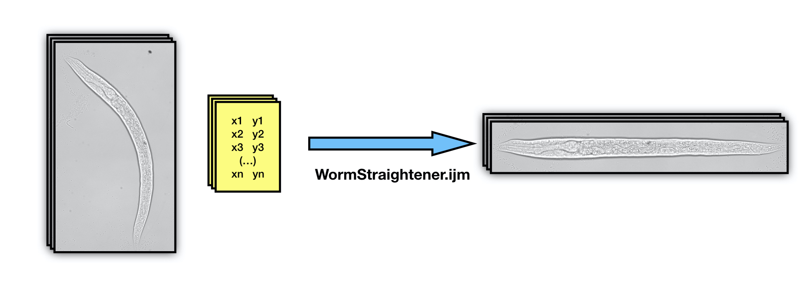

# WormStraightener

This is a simple ImageJ macro to straighten objects in a directory of images, given their corresponding coordinates. It was developed with *C. elegans* microscopy images in mind, but is generalisable to other objects.

## How to use
To come.

## Details about input files
To come

## Issues
Please report in the issues [tab](https://github.com/fxquah/WormStraightener/issues).